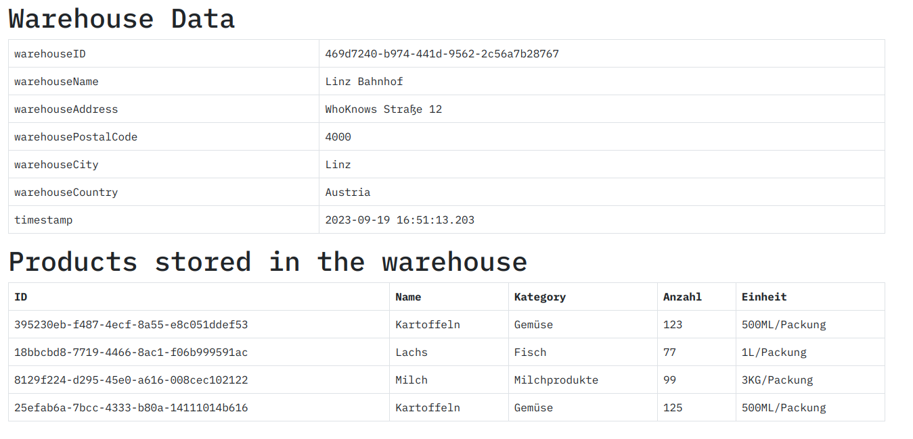

# Protokoll - DEZSYS_GK71_WAREHOUSE_REST

**Autor:** Manuel Fellner

**Version:** 19.09.2023

---

In diesem Protokoll werde ich alle von mir gemachten Schritte für die jeweilige Laborübung mittels Sätzen, Code-Snippets und Screenshots festhalten.


## 1. Benötigte Attribute / Model-Klassen hinzufügen


### 1.1 Bestandsaufnahme: Was benötigen wir?

Um der Angabe Gerecht zu werden, benötigen wir noch folgende Komponenten:

- `Klasse`: Product
  
  - Beinhaltet alle Details über unsere Produkte
  
  -  `Attribute`:
    
    - productID : UUID
    
    - productName : String
    
    - productCategory : String (-> später vielleicht auf ENUM umstellen)
    
    - productQuantity : int
    
    - productUnit : String (-> später vielleicht auf ENUM umstellen)

- `Attribute` für Klasse `WarehouseData`:
  
  - warehouseAddress : String
  
  - warehousePostalCode : int
  
  - warehouseCity : String
  
  - warehouseCountry : String
  
  - productData : Product[]


### 1.2 Hinzufügen der Attribute für die Klasse WarehouseData

Wir fügen jetzt folgendermaßen einfach die benötigten Attribute zur Klasse hinzu:

```java
	private String warehouseAddress;

	private int warehousePostalCode;

	private String warehouseCity;

	private String warehouseCountry;
```

- Nachdem wir die Attribute verändert haben, lassen wir uns mittels IntellIJ "Generate" Feature Getter- sowie Setter-Methoden für die neuen Attribute generieren

- Ebenso passen wir die `toString()` methode der Klasse an - dies machen wir ebenso mit dem "Generate" Feature.


Da wir jetzt neue Attribute haben, wäre es sinnvoll, die Generator-Methode für das Warehouse zu verändern:

```java
	public WarehouseData getData(UUID inID) {
		
		WarehouseData data = new WarehouseData();
		// parse String into UUID object, we currently want a static id
		data.setWarehouseID(inID);
		data.setWarehouseName( "Linz Bahnhof" );
		data.setWarehouseCity("Linz");
		data.setWarehouseAddress("WhoKnows Straße 12");
		data.setWarehouseCountry("Autria");
		data.setWarehousePostalCode(4000);
		data.setProductData(getFourProductData());

		return data;
	}
```

Nun haben wir die Methode mit den jeweiligen neuen Attributen erweitert.


Wenn wir jetzt die REST API neustarten und zu `http://localhost:8080/warehouse/469d7240-b974-441d-9562-2c56a7b28767/xml` navigieren, sehen wir die folgende Veränderung der Ausgabe:

```xml
<WarehouseData>
<warehouseID>469d7240-b974-441d-9562-2c56a7b28767</warehouseID>
<warehouseName>Linz Bahnhof</warehouseName>
<warehouseAddress>WhoKnows Straße 12</warehouseAddress>
<warehousePostalCode>4000</warehousePostalCode>
<warehouseCity>Linz</warehouseCity>
<warehouseCountry>Autria</warehouseCountry>
<timestamp>2023-09-19 15:35:46.685</timestamp>
</WarehouseData>
```

- Wie man hier sehen kann, hat das Hinzufügen neuer Attribute funktioniert! Diese sind jetzt nämlich hier in XML sichtbar.


Wir können natürlich auch zu `http://localhost:8080/warehouse/469d7240-b974-441d-9562-2c56a7b28767/data` navigieren, dann sehen wir die Ausgabe in JSON:

```json
{
"warehouseID":"469d7240-b974-441d-9562-2c56a7b28767",
"warehouseName":"Linz Bahnhof",
"warehouseAddress":"WhoKnows Straße 12",
"warehousePostalCode":4000,
"warehouseCity":"Linz",
"warehouseCountry":"Autria",
"timestamp":"2023-09-19 15:40:54.164"
}
```


### 1.3 Hinzufügen von benötigten Klassen

Jetzt fügen wir die benötigte Klasse hinzu.


wir haben jetzt eine Klasse namens `Product` mit den folgenden Attributen:

```java
    private UUID productID;

    private String productName;

    private String productCategory;

    private int productQuantity;

    private String productUnit;
```


## 2. Produkt-Objekte generieren

Jetzt haben wir die Grundstruktur - also die Klassen.

Im nächsten Schritt müssen wir noch vier Realitätsnahe Fake-Produkte für unser Warenhaus generieren, dies machen wir folgendermaßen:

```java
	private static final String[] productNames = {
			"Milch", "Eier", "Brot", "Reis", "Nudeln", "Kartoffeln", "Tomaten",
			"Bananen", "Äpfel", "Hühnchen", "Rindfleisch", "Lachs", "Butter",
			"Käse", "Joghurt"
	};

	private static final String[] productCategories = {
			"Milchprodukte", "Eier", "Brot und Backwaren", "Getreide und Reis",
			"Nudeln", "Gemüse", "Obst", "Obst", "Obst", "Fleisch", "Fleisch",
			"Fisch", "Milchprodukte", "Milchprodukte", "Milchprodukte"
	};
	
		private static int[] getFourRandomNumbers() {
		int firstRandomNumber = getRandomInt(0, productNames.length - 1);
		int secondRandomNumber = getRandomInt(0, productNames.length - 1);
		int thirdRandomNumber = getRandomInt(0, productNames.length - 1);
		int fourthRandomNumber = getRandomInt(0, productNames.length - 1);
		return new int[]{firstRandomNumber, secondRandomNumber, thirdRandomNumber, fourthRandomNumber};
	}

	private static Product[] getFourProductData() {
		int[] randomNumbers = getFourRandomNumbers();
		Product[] products = new Product[4];
		for (int i = 0; i < 4; i++) {
			products[i] = new Product(UUID.randomUUID(), productNames[randomNumbers[i]],
					productCategories[randomNumbers[i]], getRandomInt(75, 200),
					i == 1 ? "1L/Packung" : (i == 2 ? "3KG/Packung" : "500ML/Packung"));
		}
		return products;
	}
```

- Die ersten zwei Arrays sind Produktnamen sowie die dazu passenden Produktkategorien (die Indexe sind hier sehr wichtig!)

- Als erstes holen wir uns 4 Zufallszahlen, welche auf die Länge des Produktnamen-Arrays angepasst sind

- Danach nehmen wir diese Zufallszahlen, gehen in einen for-loop und generieren somit Objekte. Diese Objekte werden dem Array hinzugefügt

- Am Ende wird das Array mit den erstellten Produkten zurückgegeben.
  
  

Wir müssen jetzt noch die `getData()` Methode für die Simulation folgendermaßen abändern:

```java
	public WarehouseData getData(UUID inID) {
		
		WarehouseData data = new WarehouseData();
		// parse String into UUID object, we currently want a static id
		data.setWarehouseID(inID);
		data.setWarehouseName( "Linz Bahnhof" );
		data.setWarehouseCity("Linz");
		data.setWarehouseAddress("WhoKnows Straße 12");
		data.setWarehouseCountry("Autria");
		data.setWarehousePostalCode(4000);
		data.setProductData(getFourProductData());

		return data;
	}
```

- Hier fügen wir alle in der obrigen Methode erstellen Produkt-Objekte zu unserem WarehouseData Objekt hinzu


## 3. Ergebnis

#### 3.1 JSON-Ansicht


Navigieren wir zu `http://localhost:8080/warehouse/469d7240-b974-441d-9562-2c56a7b28767/data`, sehen wir die folgende JSON-Ansicht:

```json
{"warehouseID":"469d7240-b974-441d-9562-2c56a7b28767","warehouseName":"Linz Bahnhof","warehouseAddress":"WhoKnows Straße 12","warehousePostalCode":4000,"warehouseCity":"Linz","warehouseCountry":"Austria","timestamp":"2023-09-19 16:36:56.933","productData":[{"productID":"e940f2af-182d-4b49-940b-723908f53a77","productName":"Brot","productCategory":"Brot und Backwaren","productQuantity":105,"productUnit":"500ML/Packung"},{"productID":"df2a7d5e-97f9-4545-91d5-6229ba0acb05","productName":"Milch","productCategory":"Milchprodukte","productQuantity":167,"productUnit":"1L/Packung"},{"productID":"42c9feae-ee65-4e4b-ac45-c1bc5ac7355b","productName":"Kartoffeln","productCategory":"Gemüse","productQuantity":123,"productUnit":"3KG/Packung"},{"productID":"4c54e706-95bf-4602-b4a1-c152cd73eda4","productName":"Reis","productCategory":"Getreide und Reis","productQuantity":92,"productUnit":"500ML/Packung"}]}
```

#### 3.2 XML-Ansicht

Navigieren wir zu `http://localhost:8080/warehouse/469d7240-b974-441d-9562-2c56a7b28767/xml`, sehen wir folgende XML-Ansicht:

```xml
<WarehouseData>
<warehouseID>469d7240-b974-441d-9562-2c56a7b28767</warehouseID>
<warehouseName>Linz Bahnhof</warehouseName>
<warehouseAddress>WhoKnows Straße 12</warehouseAddress>
<warehousePostalCode>4000</warehousePostalCode>
<warehouseCity>Linz</warehouseCity>
<warehouseCountry>Austria</warehouseCountry>
<timestamp>2023-09-19 16:32:02.499</timestamp>
<productData>
<productData>
<productID>548aa4bf-7f72-4426-aa00-54d805e9090d</productID>
<productName>Eier</productName>
<productCategory>Eier</productCategory>
<productQuantity>131</productQuantity>
<productUnit>500ML/Packung</productUnit>
</productData>
<productData>
<productID>ef4d0385-9061-49f3-933a-63fc564cc995</productID>
<productName>Tomaten</productName>
<productCategory>Obst</productCategory>
<productQuantity>183</productQuantity>
<productUnit>1L/Packung</productUnit>
</productData>
<productData>
<productID>a0da52cd-c09f-4a89-b333-c08de225fabd</productID>
<productName>Rindfleisch</productName>
<productCategory>Fleisch</productCategory>
<productQuantity>105</productQuantity>
<productUnit>3KG/Packung</productUnit>
</productData>
<productData>
<productID>75f3551a-1275-4802-8024-48bb3a7eb3be</productID>
<productName>Tomaten</productName>
<productCategory>Obst</productCategory>
<productQuantity>140</productQuantity>
<productUnit>500ML/Packung</productUnit>
</productData>
</productData>
</WarehouseData>
```


## 3. Frontend hinzufügen

Für ein GK-Vollständig ist auch noch vorgesehen, diese erweiterte API-Schnittstelle zu konsumieren.

Heißt, dass wir hier noch einen Client benötigen, der eine GET Request an die API schickt (JSON-Format!).

Dann können wir diese JSON-Daten in einen HTML-Table rendern.

Ich werde hier mit VueJS + axios + HTML arbeiten.


### 3.1 HTML Code

Als erstes erschaffen wir ein sehr einfaches HTML-Konstrukt und befüllen es mit "Platzhaltern" sowie den benötigten For-Schleifen:

```html
<!DOCTYPE html>
<html>
<head>
    <title>Warehouse consumer</title>
    <link rel="stylesheet" href="https://cdn.jsdelivr.net/npm/bootstrap@5.3.0/dist/css/bootstrap.min.css">
</head>
<body>
<div id="app" class="container mt-5">
    <h1>Warehouse Data</h1>
    <table class="table table-bordered">
        <tbody>
        <tr v-for="(item, key) in warehouseData" :key="key">
            <td>{{ key }}</td>
            <td>{{ item }}</td>
        </tr>
        </tbody>
    </table>
    <h1>Products stored in the warehouse</h1>
    <table class="table table-bordered">
        <thead>
        <tr>
            <th>ID</th>
            <th>Name</th>
            <th>Kategory</th>
            <th>Anzahl</th>
            <th>Einheit</th>
        </tr>
        </thead>
        <tbody>
        <tr v-for="item in productData" :key="key">
            <td>{{ item.productID }}</td>
            <td>{{ item.productName }}</td>
            <td>{{ item.productCategory }}</td>
            <td>{{ item.productQuantity }}</td>
            <td>{{ item.productUnit }}</td>
        </tr>
        </tbody>
    </table>
</div>

<script src="https://cdn.jsdelivr.net/npm/vue@2.6.14/dist/vue.js"></script>
<script src="https://cdn.jsdelivr.net/npm/axios/dist/axios.min.js"></script>
```

- Hier haben wir zwei Sektionen:
  
  - Die erste beinhaltet die allgemeinen Daten über das ausgewählte Warenhaus wie z.B. ID, Name, Standort, etc.
  
  - Die zweite Sektion rendert dann die wirklichen Produkte, die in diesem Warenhaus gespeichert sind


### 3.2 VueJS Code

Jetzt müssen wir nur noch eine einfacher GET-Request an die API-URL senden, die Daten empfangen und speichern:

```javascript
<script>
    new Vue({
        el: '#app',
        data: {
            warehouseData: {},
            productData: {}
        },
        mounted() {
            // Make a GET request using Axios to fetch JSON data
            axios.get("http://localhost:8080/warehouse/469d7240-b974-441d-9562-2c56a7b28767/data")
                .then(response => {
                    this.productData = response.data.productData;
                    delete response.data.productData;
                    this.warehouseData = response.data;
                })
                .catch(error => {
                    console.error("Error fetching data: " + error.message);
                });
        }
    });
</script>
```

- `data` beinhaltet die Daten unserer zwei Sektionen: eine Sektion für die allgemeinen Daten über das Warenhaus und die andere für die Produkte

- `mounted` wird dann ausgeführt, wenn die Website refreshed wird.

- Wir speichern als erstes alle Produktdaten und löschen diese dann aus der Response

- Danach nehmen wir die übrige Response und speichern diese ebenfalls - hier sind jetzt die allgemeinen Daten zum warehouse vorhanden.


### 3.3 Ergebnis

Das fertige Frontend sieht nun folgendermaßen aus:




